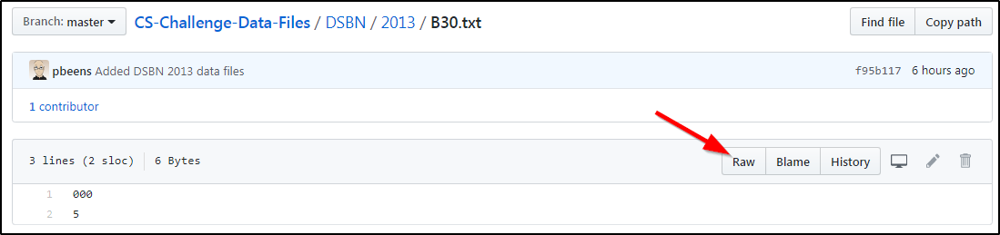

## CS-Challenge-Data-Files

See this [Python Stub](Python-Stub.py) for instructions on accessing the data files online. Note that when linking to the data files you must use the "raw" link, not the web page link: 

*(Would anyone else like to contribute instructions for other languages?)*